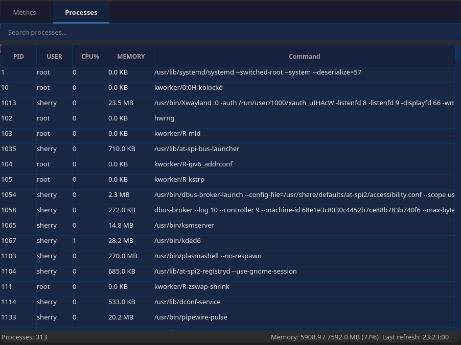
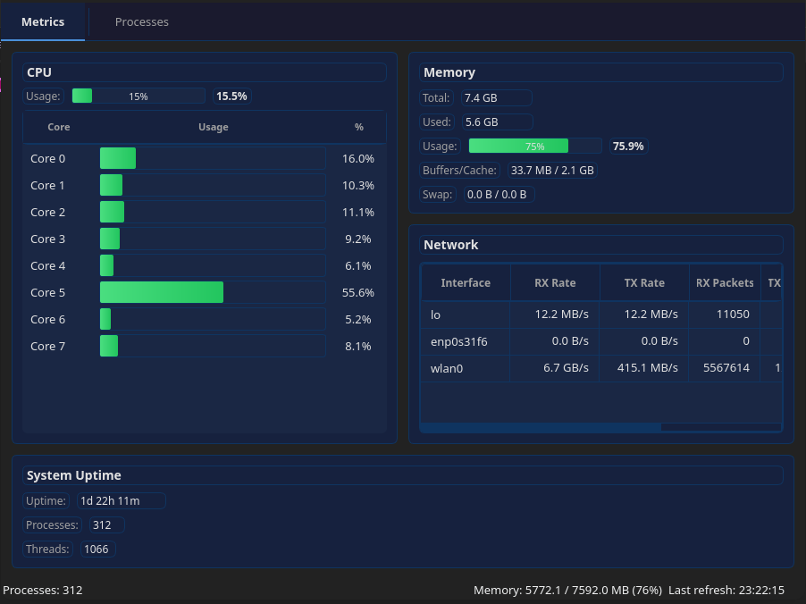

# Task Manager

A Qt6 C++17 desktop application for Linux that displays live system process information and system metrics in a modern, dark-themed GUI.


## Table of Contents

- [Features](#features)
- [Screenshots](#screenshots)
- [Prerequisites](#prerequisites)
- [Building from Source](#building-from-source)
- [Running the Application](#running-the-application)
- [Project Structure](#project-structure)
- [Architecture](#architecture)
- [Usage](#usage)
- [Data Sources](#data-sources)
- [Contributing](#contributing)
- [License](#license)

## Features

### Process Monitoring

- **Live Process Table** — Real-time display of running processes with automatic refresh every second
- **Process Information** — PID, User, CPU%, Memory%, and Command Line for each process
- **Search & Filter** — Case-insensitive search across all columns with yellow highlighting of matching text
- **Sortable Columns** — Click column headers to sort processes by any field
- **Kill Process** — Right-click on a process to send SIGTERM or SIGKILL (with confirmation dialog)
- **Process Details** — Double-click any process to view detailed information including Parent PID, threads, memory breakdown, and state

### System Metrics Dashboard

- **CPU Metrics** — Total CPU usage with per-core breakdown, load averages (1m, 5m, 15m)
- **Memory Metrics** — Total, used, available memory with buffers/cache and swap usage
- **Network Metrics** — Per-interface RX/TX rates, packet counts, and error statistics
- **System Uptime** — Total uptime display with process and thread counts

### User Interface

- **Dark Theme** — Consistent dark-themed UI across all widgets
- **Page Navigation** — Toggle between Metrics and Processes views via toolbar tabs
- **Status Bar** — Shows process count, memory usage, and last refresh timestamp
- **Responsive Window** — Window size adapts to screen geometry (max 900x750)

## Screenshots

### Processes View




### Metrics View



## Prerequisites

### Required Libraries

| Library | Minimum Version | Purpose |
|---------|----------------|---------|
| Qt6 | 6.4 | GUI framework (Core, Widgets, Gui modules) |
| CMake | 3.16 | Build system |
| Ninja | Latest | Build generator |
| GCC | 9+ (recommended 11+) | C++17 compiler |

### Arch Linux

```bash
sudo pacman -S qt6-base cmake ninja
```

### Ubuntu / Debian

```bash
sudo apt install qt6-base-dev cmake ninja-build
```

### Fedora

```bash
sudo dnf install qt6-qtbase-devel cmake ninja-build
```

## Building from Source

### 1. Clone the Repository

```bash
git clone https://github.com/sherrytelli/task-manager.git
cd task-manager
```

### 2. Configure and Build

```bash
make clean && make build
```

This will:

1. Remove any existing `build/` directory
2. Run CMake with the Ninja generator to configure the project
3. Compile the application

**Manual build** (if you prefer CMake commands directly):

```bash
cmake -S . -B build -G Ninja
cmake --build build
```

### 3. Verify Build

The compiled binary will be located at:

```
build/task-manager
```

## Running the Application

```bash
make run
```

Or run the binary directly:

```bash
./build/task-manager
```

## Project Structure

```
task-manager/
├── CMakeLists.txt          # CMake build configuration
├── Makefile                # Convenience build targets (clean, build, run)
├── .clangd                 # Clangd compile flags for IDE integration
├── .gitignore              # Git ignore rules
├── src/
│   ├── main.cpp            # Application entry point
│   ├── mainwindow.h/.cpp   # Main window with toolbar and page switching
│   ├── processeswidget.h/.cpp   # Process table and /proc data reader
│   ├── metricswidget.h/.cpp     # System metrics dashboard (CPU, Memory, Network, Uptime)
│   ├── processdetailsdialog.h/.cpp  # Process details modal dialog
│   └── highlightdelegate.h/.cpp   # Custom item delegate for search highlighting
└── build/                  # Compiled output (generated)
```

## Architecture

### Design Pattern

The application follows a **Model-View-Controller (MVC)-inspired** architecture:

- **Data Layer** — `ProcessesWidget` and `MetricsWidget` read directly from the Linux `/proc` filesystem to gather real-time system data
- **View Layer** — Qt widgets (`QTableWidget`, `QGridLayout`, `QProgressBar`) render the UI
- **Custom Delegate** — `HighlightDelegate` extends `QStyledItemDelegate` to draw search-match highlights in the process table

### Data Flow

```
/proc filesystem
    │
    ▼
ProcessesWidget / MetricsWidget (data collection)
    │
    ▼
QTimer (1000ms refresh interval)
    │
    ▼
QTableWidget / QProgressBar (UI updates)
    │
    ▼
MainWindow (status bar updates)
```

### Key Components

| Component | Responsibility |
|-----------|---------------|
| `MainWindow` | Window chrome, toolbar navigation, status bar, page switching via `QStackedWidget` |
| `ProcessesWidget` | Process table, search/filter, context menu (kill), double-click details, live refresh |
| `MetricsWidget` | CPU, memory, network, and uptime cards with per-core CPU bars and network rate calculations |
| `ProcessDetailsDialog` | Modal dialog showing full process information |
| `HighlightDelegate` | Custom painter for yellow-highlighting search matches in table cells |

## Usage

### Process View

- **Search:** Type in the search box to filter processes across all columns
- **Sort:** Click any column header to sort ascending; click again to sort descending
- **Kill a process:** Right-click on a process row and choose **Kill Process (SIGTERM)** or **Kill Process (SIGKILL)**
- **View details:** Double-click any process row to open the details dialog

### Metrics View

- **CPU Card:** Shows total CPU usage and per-core usage with progress bars
- **Memory Card:** Displays total, used, buffers/cache, and swap memory
- **Network Card:** Shows per-interface data rates, packet counts, and errors
- **System Uptime Card:** Shows system uptime, process count, and thread count

All metrics refresh every second automatically.

## Data Sources

The application reads system data from the Linux `/proc` filesystem:

| Data | Source File |
|------|------------|
| Process list | `/proc/` directory (numeric entries) |
| Process name, user, state, threads | `/proc/[pid]/status` |
| Process CPU ticks, parent PID, start time | `/proc/[pid]/stat` |
| Process memory (PSS) | `/proc/[pid]/smaps_rollup` |
| Shared pages | `/proc/[pid]/statm` |
| Command line | `/proc/[pid]/cmdline` |
| System memory info | `/proc/meminfo` |
| CPU usage | `/proc/stat` |
| Network stats | `/proc/net/dev` |
| System uptime | `/proc/uptime` |

## Contributing

Contributions are welcome! Here's how you can help:

### Getting Started

1. **Fork** the repository
2. **Create** a feature branch from `main`:
   ```bash
   git checkout -b feature/your-feature-name
   ```
3. **Make** your changes
4. **Build** and verify:
   ```bash
   make clean && make build
   ```
5. **Commit** your changes:
   ```bash
   git commit -m "Add: your feature description"
   ```
6. **Push** to your fork:
   ```bash
   git push origin feature/your-feature-name
   ```
7. **Open** a Pull Request

### Pull Request Guidelines

- Provide a clear description of the changes
- Reference any related issues
- Ensure the project builds cleanly with `make clean && make build`
- Follow the existing C++ coding standards (C++ Core Guidelines)
- Match the existing code style and Qt6 desktop UX patterns

### Reporting Bugs

If you find a bug, please [open an issue](https://github.com/sherrytelli/task-manager/issues) with:

- A clear description of the bug
- Steps to reproduce
- Your Linux distribution and Qt6 version

## License

This project is licensed under the [MIT License](LICENSE).

## Acknowledgments

- CPU% calculation inspired by the KDE ksysguardd approach (tick delta divided by interval in 100ths of a second)
- Memory% calculation uses PSS (Proportional Set Size) from `/proc/[pid]/smaps_rollup`
- Built with [Qt6](https://www.qt.io/) — a cross-platform application framework
